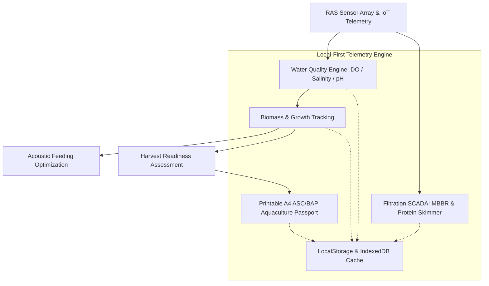

# 🌊 AquaMarine Farm — Commercial Aquaculture & Recirculating Aquaculture Systems (RAS) OS

<p align="center">
  
  
  
  
  
  
  
  
</p>

> 🚀 **Live Production Application:** [https://olyxmintabansos-byte.github.io/aquamarine-farm/](https://olyxmintabansos-byte.github.io/aquamarine-farm/)

---

### 🌐 System Overview & Vision

**AquaMarine Farm (Titan #32)** adalah platform operasi budidaya perikanan modern dan *Recirculating Aquaculture System (RAS)* terpadu berskala komersial yang dirancang sesuai standar sertifikasi global **Aquaculture Stewardship Council (ASC)** dan **Best Aquaculture Practices (BAP)**.

Dibangun dengan arsitektur **Client-Side Local-First**, AquaMarine Farm mengintegrasikan telemetri kualitas air real-time (*Dissolved Oxygen, Salinitas, pH, Suhu*), manajemen biomassa stok ikan & optimasi rasio konversi pakan (*FCR*), pemantauan filtrasi sirkulasi air tertutup (MBBR, protein skimmer, sterilisasi UV), serta generator paspor sertifikasi mutu A4 tanpa ketergantungan server runtime atau latensi jaringan.

---

### 🎨 Design System: #23 Aurora Deep Oceanic Gradient Mesh

Antarmuka AquaMarine Farm memadukan estetika maritim modern dengan keterbacaan data instrumen presisi tinggi:
- **Deep Oceanic Aurora Gradient**: Gradien mesh atmosferik yang terinspirasi oleh kedalaman laut (*Abyssal Navy `#0A1128`*, *Deep Bioluminescent Cyan `#00E5FF`*, *Seafoam Emerald `#10B981`*, dan *Midnight Blue `#001F54`*).
- **Glassmorphic Water Cards**: Panel transparan dengan efek blur lembut (`backdrop-blur-md bg-white/5 border border-cyan-500/20`) yang merefleksikan kejernihan air kolam budidaya.
- **Dynamic Vitals Glow**: Kartu sensor kualitas air memiliki indikator denyut cahaya (*aurora pulse*) saat parameter oksigen atau amonia mendekati ambang kritis.

---

### 🌟 Key Functional Pillars

#### 1. 💧 Telemetri Kualitas Air Kolam RAS (`/` & `/water`)
- **Real-Time Sensor Ingestion**: Pemantauan continuous kadar oksigen terlarut (*Dissolved Oxygen / DO mg/L*), tingkat keasaman (*pH*), salinitas (*ppt*), suhu air (°C), serta saturasi amonia (TAN) dan nitrit.
- **RAS Multi-Stage Filtration SCADA**: Status operasional drum screen filter mekanis, Moving Bed Biofilm Reactor (MBBR), protein skimmer untuk pembuangan senyawa organik terlarut, dan desinfeksi sinar ultraviolet (UV).
- **Oxygen Depletion Critical Alarm**: Peringatan visual dan akustik instan jika kadar oksigen terlarut turun di bawah batas aman spesies (5.5 mg/L).

#### 2. 🐟 Manajemen Biomassa & Algoritma Pakan Akustik (`/biomass`)
- **Stock Biomass Calculator**: Perhitungan total biomassa kolam (kg), estimasi berat rata-rata per individu (gram), dan kepadatan tebar (*stocking density kg/m³*).
- **Feed Conversion Ratio (FCR) Optimization**: Kalkulasi rasio efisiensi pakan vs pertambahan bobot daging ikan.
- **Acoustic Feeding Response**: Simulasi deteksi aktivitas makan ikan berbasis sensor akustik dasar kolam untuk mencegah pemborosan pakan dan pencemaran air.

#### 3. 🛡️ Penelusuran ASC & BAP Certified Passport A4 (`/traceability`)
- **Farm-to-Fork Traceability**: Pencatatan riwayat siklus hidup benih (hatchery), batch pakan berprotein bersertifikasi lestari, dan log pemeriksaan bebas antibiotik.
- **Printable A4 Aquaculture Passport**: Generator paspor asal-usul panen siap cetak format A4 lengkap dengan kode QR verifikasi publik dan pengesahan Direktur Operasional Akuakultur.

---

### 🏗️ Architecture & Data Flow



---

### 📁 Directory Layout

```
aquamarine-farm/
├── public/
│   └── .nojekyll                 # Jekyll bypass for GitHub Pages
├── src/
│   ├── app/
│   │   ├── biomass/page.tsx      # Fish biomass, stocking density & FCR
│   │   ├── traceability/page.tsx # ASC/BAP harvest passport A4 generator
│   │   ├── water/page.tsx        # RAS filtration: MBBR, skimmer & UV
│   │   ├── layout.tsx            # Global layout with Deep Oceanic Aurora styling
│   │   └── page.tsx              # Water quality telemetry & RAS tank overview
│   ├── components/
│   │   └── Navbar.tsx            # Oceanic header & dissolved oxygen status
│   ├── context/
│   │   └── AquaContext.tsx       # RAS reactive state machine & sensor streams
│   └── types/
│       └── aqua.ts               # Tank, sensor telemetry & biomass schema
├── next.config.ts                # Static export configuration
└── package.json                  # Dependencies & scripts
```

---

### 🛠️ Technology Stack

| Domain | Technology / Library | Rationale |
|---|---|---|
| **Framework** | Next.js 16.3 (App Router) | High-speed static generation for remote offshore and coastal aquaculture stations |
| **Language** | TypeScript (Strict Mode) | Zero-defect biometric calculations and RAS hydraulics schemas |
| **Styling** | Tailwind CSS v4 | Deep Oceanic Aurora gradient styling with low GPU footprint |
| **Icons & UI** | Lucide React | Marine, hydraulic, and environmental sensor iconography |
| **Visual FX** | Canvas-Confetti | Interactive harvest celebration on batch clearance |
| **Persistence** | Local-First Storage | Offline-capable farm telemetry without dependent marine satellite subscriptions |
| **Deployment** | GitHub Pages (`gh-pages`) | Static hosting with `.nojekyll` bypass |

---

### 🚀 Getting Started & Local Development

Clone repositori dan jalankan pada local development environment:

```bash
# 1. Clone repository
git clone https://github.com/olyxmintabansos-byte/aquamarine-farm.git
cd aquamarine-farm

# 2. Install dependencies
npm install

# 3. Jalankan development server
npm run dev
```

Buka [http://localhost:3000](http://localhost:3000) pada browser Anda.

#### Build & Static Export

```bash
# Build static export ke direktori out/
npm run build

# Deploy langsung ke GitHub Pages branch gh-pages
npx --yes gh-pages -d out -b gh-pages --dotfiles
```

---

### 📄 License & Attribution

Didistribusikan di bawah lisensi MIT. Silakan gunakan untuk tambak modern, RAS hatchery, riset biologi kelautan, maupun industri perikanan.

<p align="center">
  
  
</p>

<p align="center">
  <strong>© 2026 by Olyx (@olyxmintabansos-byte)</strong> • All rights reserved.
</p>
